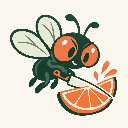

# Fruit Fly Fruit Ninja — the tiniest salad bar



A playable Three.js kitchen: flies rest on shelves, jars and counter edges, then fly through the room to carry a shared knife. Choose a salad, recruit its learned fruit fans and time the chop. Inspect any chef's live neural activity in the rotatable Brain panel.

**Play online: https://fruit-fly-fruit-ninja.vercel.app**

Brand assets, image-generation prompts, and search/social metadata notes: [BRAND.md](BRAND.md).

## Flight modes

The kitchen starts with **Learned action readout** under **Who is steering?**, with **Autopilot** and **Untrained** available for comparison. Switch them live, or use **Train & inspect flight → Restart round** for a fresh comparison. A pretrained 3D lesson ships with the game; saved flight lessons are preserved on reload. **Erase flight learning** removes its motor outputs; **Train flight readout** learns them again in the browser, and **Restore trained flight** reloads the starter lesson. These controls preserve learned fruit smell preferences.

Choose **Flight circuit** in the Brain panel to inspect the motor features and applied force; **Smell circuit** shows smell learning. Learning steers each fly from its shelf to the knife and back, and controls the knife's XYZ forces and rotation. Flies follow spatial waypoints through physical feedback rather than timed animation. Try the **wind icon** in the kitchen’s top toolbar to watch them recover. See [GAME_MODEL.md](GAME_MODEL.md) for the distinction and measured results.

## Play

Requires Node.js 22+ and a WebGL-capable browser. No package install, API key or internet connection is needed. Double-click `launch.cmd`, or:

```powershell
npm start
```

Open **http://127.0.0.1:5184**. The server listens only on your computer. Keep its terminal running.

Use **Fullscreen** in the kitchen's top-right corner to expand the scene, Brain panel, and chop controls. **Escape** or **Exit fullscreen** returns to the page; **Menu & training** takes you back to orders or smell school. Your current order continues across view changes. Browsers without native fullscreen use a viewport-filling view.

1. Order **Sunshine bowl**. Apple fans fly out and lift the knife.
2. Hit **Chop** or **Space** when the timing marker reaches the green zone. The moving blade must physically touch the fruit.
3. Repeat for orange and strawberry; each ingredient recruits its own crew. Finish the bowl for a bonus.
4. Order **Green surprise**. Nobody knows kiwi yet. In **Smell school**, select two chefs and teach kiwi. Their connections strengthen, they volunteer, and the waiting order continues.
5. Try a **90-second rush**, make a custom mix, or open the brain inspector and clear learning to see volunteering disappear.

Drag the scene to orbit, scroll to zoom, and click a fly to inspect its brain. Chef cards select flies for training. The Brain inset also has a fly selector, a rotatable neural cloud, and a **Sniff** button that activates the selected circuit without training it. Carriers must all reach their grips before the knife lifts, and they stay attached without following lag. Sound is optional. Learned smell preferences last until page reload; the best rush score stays in local storage. Tab hiding pauses the simulation. Canceling an order returns to the menu while keeping earned points and the remaining rush time.

## Learning, honestly

The game uses an immutable real connectome extraction (319 neurons, 2,117 edges). Synthetic odors pass through anatomical PN → KC connections; each chef has independent plastic KC → MBON strengths. Starter favorites are acquired through recorded training. Teaching changes eligible connections, which changes volunteering.

The snack-learning rule is an **engineered appetitive extension**; it is not the original aversive PPL1 learning model. The knife has XYZ translation, quaternion rotation, and swept 3D blade contact driven by an engineered motor controller. Flies use learned force/torque control toward engineered waypoints and ideal grip constraints; food halves and plating use contact-triggered animation. The Brain panel shows live model rates with schematic positions, not measured spikes or soma coordinates. The game makes no claim of improving human neuroplasticity. See [GAME_MODEL.md](GAME_MODEL.md) for equations, assumptions and limits, and [DATA_PROVENANCE.md](DATA_PROVENANCE.md) for data attribution.

The original learned-motor laboratory remains at **/lab.html**, with its Canvas fallback at **/index2d.html**. Its measured benchmarks and model card are unchanged and apply only to that laboratory. See [LAB_README.md](LAB_README.md).

## Deploy

The project is hosted on Vercel as a static site and connected to its GitHub repository. Production deployments use `vercel.json`; no server process, build step, or package installation is needed on the host. To deploy from an authenticated Vercel CLI, run `vercel deploy --prod`. Local environment files and Vercel account metadata are excluded from uploads, Git and the download package.

## Verify

```powershell
npm test
npm run salad:benchmark
```

The current suite includes 41 tests. Checks cover selective plasticity, reset/retraining, anatomical wiring sensitivity, 3D contact detection, all 28 two-chef combinations, carrier arrival and coupling, live neural activity, all recipes, timing and rush expiration. Current simulation results are in `evidence/salad-results.json`; browser verification is in `evidence/spatial-flight-review.md`.

For the original lab: `node scripts/physics-benchmark.mjs` and `npm run experiment`.

## Main files

- `src/fruit-memory.js`: odor inputs, anatomical feature circuit and independent plastic strengths.
- `src/salad-game.js`: recruitment, phase transitions, physical knife contact and scoring.
- `src/salad-scene.js`: kitchen, flies, knife, fruit halves, camera and visual effects.
- `src/flight3d.js`: perches, physical XYZ navigation, banking targets, quaternion rigid-body motion and exact carrier attachment.
- `src/brain-panel.js`: rotatable 3D schematic driven by the selected fly's rate-model state.
- `src/salad-app.js`, `index.html`, `salad.css`: playable interface and brain inspector.
- `src/physics.js`: preserved planar laboratory simulator and engineering motor controller.
- `lab.html`, `src/app.js`, `src/neural.js`: preserved motor-learning lab.
- `vendor/three/`: locally bundled Three.js 0.186.0, MIT licensed.

Code: MIT. Anatomical data: CC BY 4.0, credited to FlyEM at HHMI Janelia, University of Cambridge, MRC Laboratory of Molecular Biology and Google Research. See `LICENSE`, `THIRD_PARTY_LICENSE` and `DATA_PROVENANCE.md`.
